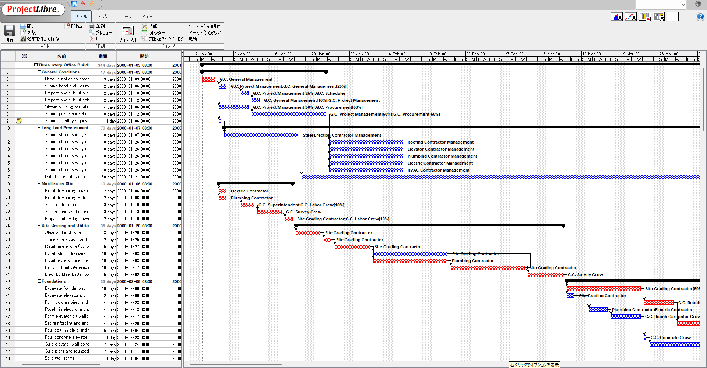

# ProjectLibre Development Fork

This repository is an unofficial development fork of ProjectLibre. It keeps the original desktop planning tool as its base and extends it with practical improvements for day-to-day scheduling, collaboration, import/export, and Gantt usability.

Current release in this fork:

- `v0.0.2`



## What This Fork Is For

- Keep ProjectLibre usable on a modern JDK and packaging toolchain
- Improve real-world planning workflows instead of only preserving legacy behavior
- Add collaboration-oriented features for teams sharing project files locally
- Make the Gantt and spreadsheet views smoother to use for large schedules

## Baseline And Update Ratio

The comparison baseline in this fork is the ProjectLibre 1.9.8 modernization commit:

- Commit: `0530be227f4a10c5545cce8d3db20ac5a4d76a66`
- Subject: `ProjectLibre 1.9.8 Java and Libraries updates Code using deprecated apis updated Performance fixes Toolbar fixes New builds using jpackage supporting Java 21 and ARM architecture.`

The figures below describe cumulative change volume since that baseline commit.

- Changed tracked file paths since `0530be22`: `2289 / 2386` (`95.9%` of the baseline tracked file count)
- Changed tracked text lines since `0530be22`: `673624`

## What Has Been Added Or Improved Since `0530be22`

- XLSX import/export support and related collaboration refresh behavior
- Local collaboration support for shared project files
- Gantt and Tracking Gantt progress-line improvements
- Gantt zoom restore behavior
- Mouse-wheel and horizontal scrolling refinements
- Startup and initial view loading fixes
- Logging cleanup, resource-leak fixes, and modernized build/CI setup

## Repository Layout

- `projectlibre_core`: scheduling engine, data model, collaboration logic, and configuration
- `projectlibre_ui`: Swing UI, Gantt rendering, spreadsheet views, menus, and startup flow
- `projectlibre_exchange`: file exchange, import/export, and format integration code
- `projectlibre_reports`: report-related code and templates
- `projectlibre_contrib`: shared third-party dependencies built into the app distribution
- `projectlibre_build`: packaging assets, release metadata, icons, installers, and licenses
- `sample data`: sample project files for screenshots and manual verification

## Requirements

- Windows with a full JDK that includes `jpackage`
- JDK 26 recommended
- Gradle Wrapper support files are included in this repository
- WiX Toolset on `PATH` for MSI packaging

If `JAVA_HOME` is not set, the Gradle release tasks fall back to `C:\Program Files\Java\jdk-26.0.1`.

## Build System Status

- Gradle is the primary build and release entrypoint for this repository
- `build.gradle.kts` and `gradlew.bat` are the supported day-to-day workflow
- `projectlibre_build` still contains packaging assets, icons, licenses, and legacy metadata
- `projectlibre_build/build.xml` remains in the repo as a historical packaging reference, but it is not the recommended build path

## Build The App

The default build entrypoint is now the Gradle wrapper from the repository root.

Compile every module and assemble the desktop distribution artifacts:

```powershell
.\gradlew.bat build
```

Create the installable application layout:

```powershell
.\gradlew.bat stageAppDist
```

Key Gradle entrypoints:

- `.\gradlew.bat projects`: show the multi-project layout
- `.\gradlew.bat :projectlibre_contrib:build`: rebuild contrib JARs
- `.\gradlew.bat :projectlibre_ui:run`: launch the desktop app from source
- `.\gradlew.bat :projectlibre_ui:installDist`: create the runnable app layout

The runnable application layout is generated under:

- `projectlibre_ui\build\install\projectlibre_ui`

The per-module JARs are generated under each module's `build\libs` directory.

For a quick desktop launch during development:

```powershell
.\gradlew.bat :projectlibre_ui:run
```

## Build The Windows Release

Build the Windows self-contained EXE, split it into GitHub-safe download parts, and publish those parts into `docs/downloads/` for GitHub Pages:

```powershell
.\gradlew.bat publishReleaseToDocs
```

The Gradle release flow uses `stageAppDist` and `:projectlibre_ui:installDist` as its application input, runs `jpackage` directly, and writes release work files under:

- `build/releases/v0.0.2/`

The Gradle task writes the generated self-contained release files into local output directories such as:

- `build/releases/v0.0.2/exe/ProjectLibre-0.0.2.exe`
- `docs/downloads/ProjectLibre-0.0.2-app-image.zip`

For public distribution, this repository's GitHub Pages page can link directly to the GitHub Releases page for `v0.0.2` instead of storing oversized binaries in Git history.

The GitHub Pages landing page for this release is:

- `docs/index.html`

If WiX was installed per-user rather than system-wide, keep its `bin` directory available on `PATH`. The Gradle MSI task prepends the common per-user install path automatically:

```text
%LOCALAPPDATA%\Programs\WiX Toolset v7.0\bin
```

## Screenshot Procedure Used In This Repository

The README screenshot is intentionally captured so that only the application UI is visible.

- Launch the app by itself, not the whole desktop workspace
- Open `sampledata.mpp`
- Arrange the main Gantt view at a readable zoom level
- Capture only the app window client area so title-bar paths, taskbar items, IDE windows, notifications, and personal information do not appear

## Quick Verification

- `.\gradlew.bat projects`: multi-project Gradle layout resolves
- `.\gradlew.bat build`: all Gradle modules compile and package successfully
- `.\gradlew.bat stageAppDist`: runnable app layout is generated
- `.\gradlew.bat publishReleaseToDocs`: Windows release artifacts are rebuilt and copied into `docs/downloads`

## License

This fork builds on ProjectLibre and keeps the original license materials and third-party notices in `projectlibre_build/license`.
