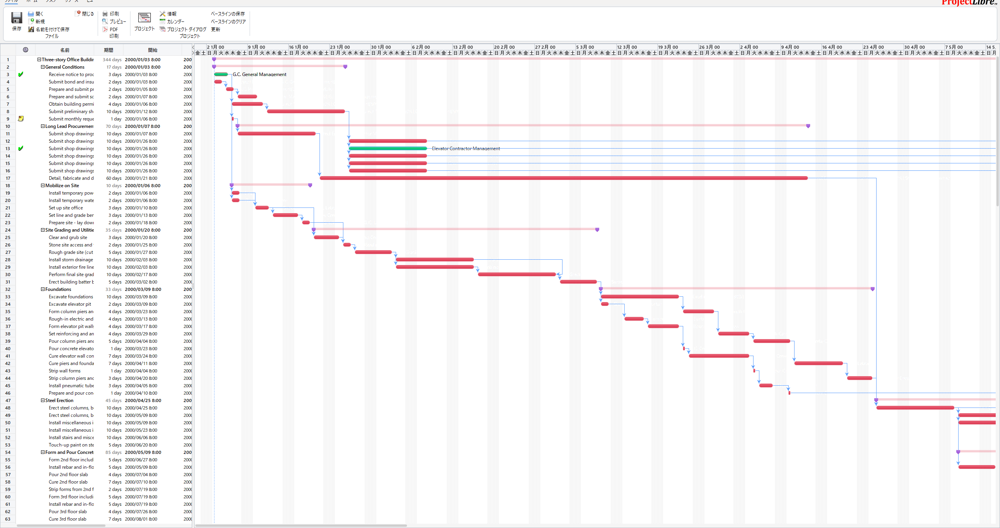

# ProjectLibre Development Fork

This repository is an unofficial development fork of ProjectLibre. It keeps the original desktop planning tool as its base and extends it with practical improvements for day-to-day scheduling, collaboration, import/export, and Gantt usability.

Current release in this fork:

- `v0.0.4`



## What This Fork Is For

- Keep ProjectLibre usable on a modern JDK and packaging toolchain
- Improve real-world planning workflows instead of only preserving legacy behavior
- Add collaboration-oriented features for teams sharing project files locally
- Make the Gantt and spreadsheet views smoother to use for large schedules

## Baseline And Update Ratio

The comparison baseline in this fork is the ProjectLibre 1.9.8 modernization commit:

- Commit: `0530be227f4a10c5545cce8d3db20ac5a4d76a66`
- Subject: `ProjectLibre 1.9.8 Java and Libraries updates Code using deprecated apis updated Performance fixes Toolbar fixes New builds using jpackage supporting Java 21 and ARM architecture.`

The figures below describe cumulative change volume since that baseline commit.

- Changed tracked file paths since `0530be22`: `2289 / 2386` (`95.9%` of the baseline tracked file count)
- Changed tracked text lines since `0530be22`: `673624`

## What Has Been Added Or Improved Since `0530be22`

- XLSX import/export support and related collaboration refresh behavior
- Local collaboration support for shared project files
- Gantt and Tracking Gantt progress-line improvements
- Gantt zoom restore behavior
- Mouse-wheel and horizontal scrolling refinements
- Startup and initial view loading fixes
- Logging cleanup, resource-leak fixes, and modernized build/CI setup

## Repository Layout

- `projectlibre_core`: scheduling engine, data model, collaboration logic, and configuration
- `projectlibre_ui`: Swing UI, Gantt rendering, spreadsheet views, menus, and startup flow
- `projectlibre_exchange`: file exchange, import/export, and format integration code
- `projectlibre_reports`: report-related code and templates
- `projectlibre_contrib`: shared third-party dependencies built into the app distribution
- `projectlibre_build`: packaging assets, release metadata, icons, installers, and licenses
- `sample data`: sample project files for screenshots and manual verification

## Requirements

- Windows with a full JDK that includes `jpackage`
- JDK 26 recommended
- Gradle Wrapper support files are included in this repository
- WiX Toolset on `PATH` for MSI packaging

If `JAVA_HOME` is not set, the Gradle release tasks fall back to `C:\Program Files\Java\jdk-26.0.1`.

## Build System Status

- `ant` is the supported build and release entrypoint for the desktop packaging flow in this repository
- `projectlibre_build/build.xml` drives compile, dist, fatjar, and Windows `jpackage` packaging
- `projectlibre_build` also contains the packaging assets, icons, notices, and Windows file-association metadata used for release builds
- Keep `projectlibre_contrib` jars lean when updating dependencies so the packaged app size does not grow unnecessarily

## Build The App

Compile every module and assemble the desktop distribution artifacts:

```powershell
ant -f projectlibre_build\build.xml compile
ant -f projectlibre_build\build.xml dist
```

Create the runnable single-jar package:

```powershell
ant -f projectlibre_build\build.xml fatjar
```

Key Ant entrypoints:

- `ant -f projectlibre_build\build.xml compile`: compile all production modules against Java 21 bytecode
- `ant -f projectlibre_build\build.xml dist`: build `projectlibre.jar` plus the trimmed contrib jars
- `ant -f projectlibre_build\build.xml fatjar`: create `projectlibre_build\packages\projectlibre-<version>.jar`
- `ant -f projectlibre_build\build.xml jpackage-msi`: prepare the Windows MSI packaging input directory
- `powershell -ExecutionPolicy Bypass -File projectlibre_build\packages\jpackage-msi\make.ps1 -PackageType msi -OutputDir app`: emit the Windows MSI

The runnable application layout is generated under:

- `projectlibre_build\dist`

The packaged jars are generated under:

- `projectlibre_build\packages`

## Build The Windows Release

Build the Windows release artifacts and stage them locally:

```powershell
ant -f projectlibre_build\build.xml dist
ant -f projectlibre_build\build.xml fatjar
ant -f projectlibre_build\build.xml jpackage-msi
powershell -ExecutionPolicy Bypass -File projectlibre_build\packages\jpackage-msi\make.ps1 -PackageType msi -OutputDir app
```

This release flow stages the Windows packaging input under:

- `projectlibre_build\packages\jpackage-msi\source\`

The local MSI output is generated under:

- `projectlibre_build\packages\jpackage-msi\app\ProjectLibre-0.0.4.msi`

Files under `docs/downloads/` are treated as scratch space only and should not be committed. Public downloads should be published as GitHub Release assets for `v0.0.4`, and the GitHub Pages site should link to that release page instead of serving binaries from the repository itself.

The GitHub Pages landing page for this release is:

- `docs/index.html`

If WiX was installed per-user rather than system-wide, keep its `bin` directory available on `PATH`. The Gradle MSI task prepends the common per-user install path automatically:

```text
%LOCALAPPDATA%\Programs\WiX Toolset v7.0\bin
```

## Screenshot Procedure Used In This Repository

The README screenshot is intentionally captured so that only the application UI is visible.

- Launch the app by itself, not the whole desktop workspace
- Open `sampledata.mpp`
- Arrange the main Gantt view at a readable zoom level
- Capture only the app window client area so title-bar paths, taskbar items, IDE windows, notifications, and personal information do not appear

## Quick Verification

- `ant -f projectlibre_build\build.xml compile`: all production modules compile successfully
- `ant -f projectlibre_build\build.xml dist`: runtime jars are rebuilt successfully
- `ant -f projectlibre_build\build.xml fatjar`: the runnable jar is generated
- `ant -f projectlibre_build\build.xml jpackage-msi`: Windows packaging input is rebuilt
- `powershell -ExecutionPolicy Bypass -File projectlibre_build\packages\jpackage-msi\make.ps1 -PackageType msi -OutputDir app`: the MSI is emitted successfully

## License

This fork builds on ProjectLibre and keeps the original license materials and third-party notices in `projectlibre_build/license`.
