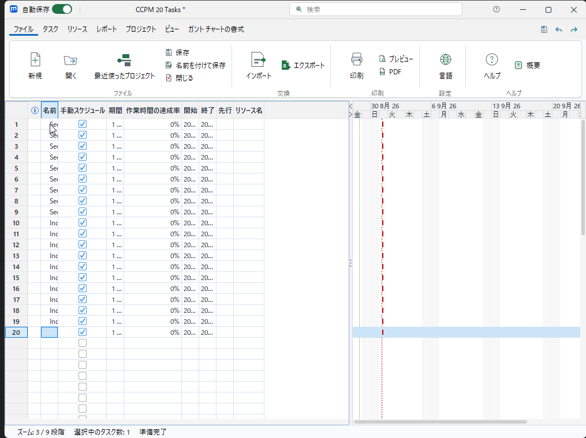
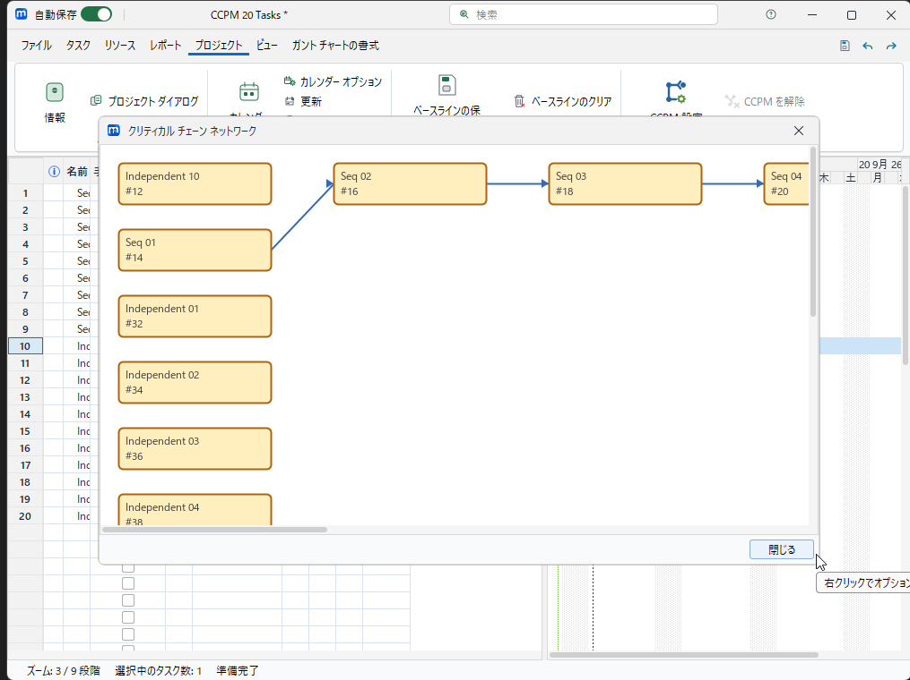
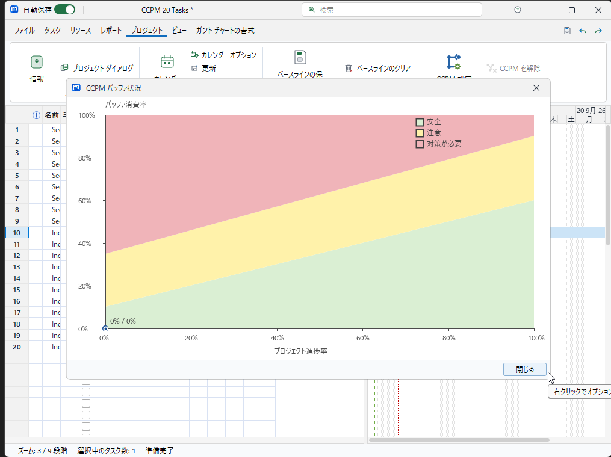

# microProject GUI操作マニュアル：新規作成からCCPMグラフまで

この手順は、microProjectだけを操作して、新しいプロジェクトにタスクを入力し、CCPM（クリティカルチェーン）を適用してグラフを表示するためのものです。

## 画面をmicroProjectだけに限定する

1. `scripts\run_micrproject_clean.bat` で起動する（または `modules\micrproject_ui\build\install\micrproject_ui` から起動する）。
2. 起動後、microProjectのタイトルバーをダブルクリックして最大化する。
3. デスクトップ、タスクバー、エクスプローラー、ターミナルなどが見えている状態では確認・撮影を開始しない。
4. スクリーンショットが必要な場合は、デスクトップ全体ではなくmicroProjectウィンドウだけを対象にする。画像の下端にタスクバーがないこと、左右に他アプリがないことを確認する。

> このマニュアルに添付した画像も、microProjectウィンドウ領域だけを切り出しています。

## 新しいプロジェクトを作る

1. **ファイル > 新規**を選ぶ。
2. 新規プロジェクト画面でプロジェクト名を入力する。
3. **OK**を押す。空のタスク表が表示されれば作成完了。

## タスクを入力する

1. タスク表の「名前」セルを選び、タスク名を入力してEnterを押す。
2. 次の行へ移動し、同じ操作を繰り返す。行を追加する場合は`Insert`キーを使う。
3. 連続タスクは「先行」列に直前のタスクIDを入力する（例：2行目に`1`、3行目に`2`）。
4. 独立タスクは「先行」列を空欄のままにする。
5. 期間、開始日、終了日、リソース名を必要に応じて入力する。
6. 入力後、行番号が想定件数になっていることと、先行列の値が数値IDになっていることを確認する。

## CCPMを適用する

1. **プロジェクト**タブを開く。
2. **CCPM設定**を押す。
3. 「クリティカルチェーン・プロジェクト管理を使用する」を有効にする。
4. プロジェクトバッファなどの値を確認する。
5. **プレビュー**を押し、競合・遅延・対象タスクを確認する。
6. 内容に問題がなければ**平準化を適用**を押す。
7. **閉じる**を押す。

## CCPMグラフを表示する

- **CCPMネットワーク**：`Ctrl+Shift+N`
- **CCPMバッファ状況**：`Ctrl+Shift+K`

ネットワーク図では、連続タスクが矢印で接続され、独立タスクが別ノードとして表示されることを確認する。空白の場合は、CCPM設定で先に**平準化を適用**しているかを確認する。

## 保存と再確認

CCPM設定、ベースライン、CCPM観測履歴を保持する場合は、**名前を付けて保存**で`.mpo`形式を選ぶ。現行MPOFでは`ccpm/history.jsonl`に観測点が保存される。保存後に閉じ、同じファイルを再度開いてタスク、先行関係、ネットワーク図、バッファグラフの履歴点が維持されることを確認する。`.pod`ではCCPM固有情報が保持されないため使用しない。

## 実践シナリオ：進捗とバッファの週次更新

1. 履歴なしから始める場合は`CCPM 標準システム導入 20タスク.mpo`を開きます。保存済み履歴を確認する場合は`CCPM 標準システム導入 20タスク（履歴付き）.mpo`を開きます。後者は最初から4観測点（0% / 0%、25% / 20%、50% / 55%、75% / 30%）を持つため、CCPMを適用して`Ctrl+Shift+K`を開くと折れ線が復元されます。
2. 1週目の更新として、完了タスクの達成率を約25%にし、結合確認タスクの期間を1日延長する。バッファ消費が少し増え、グラフは右上へ移動する。
3. 中間レビューで達成率を約50%にし、関係者確認の遅れをもう1日入力する。進捗は右へ進むが、バッファ消費が注意領域へ近づく。
4. 対策として確認方法を見直し、達成率を約75%まで進め、延長した期間を1日分戻す。進捗を維持したままバッファ消費が下がり、安全領域へ戻る。
5. 各更新後に`Ctrl+Shift+K`を開き直し、観測点が1点ずつ増えることを確認する。グラフ上のラベルは「プロジェクト進捗% / バッファ消費%」である。
6. **名前を付けて保存**で同じ`.mpo`へ保存し、ファイルを閉じて再度開く。`ccpm/history.jsonl`が読み込まれ、保存前の観測点がグラフに復元されることを確認する。
7. 必要に応じて履歴をCSV／HTMLレポートへ出力し、週次会議では週初・週末の進捗、消費率、ゾーン遷移、最終更新者を確認する。

このシナリオは、0%/0%から右肩上がりに進行しながら、一時的にバッファが悪化し、対策後に回復する通常の運用を模擬する。実GUIの確認では、画面キャプチャはmicroProjectウィンドウだけを対象にする。

## トラブルシューティング

- 「無効な先行です」：先行列にタスクID以外の文字が入っていないか確認し、セルを選んで数値を直接入力する。
- ネットワークが開けない：「CCPMを適用してください」と表示された場合は、CCPM設定で**平準化を適用**してから再実行する。
- 他の画面が写る：確認を中断し、microProjectを最大化してから撮影し直す。デスクトップ全体のキャプチャは記録に使用しない。
