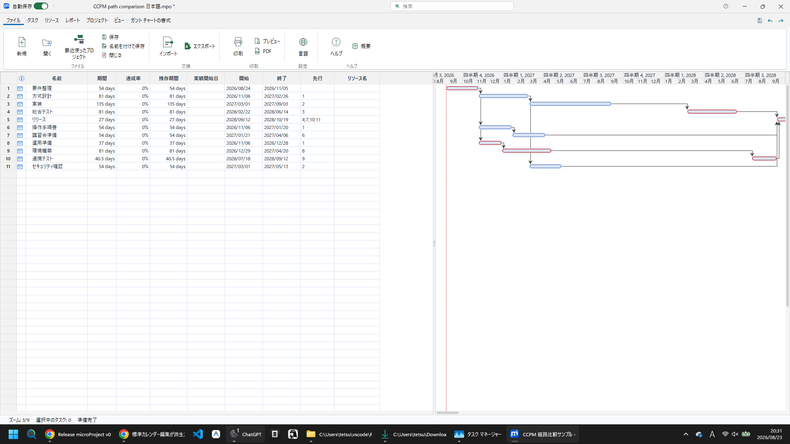
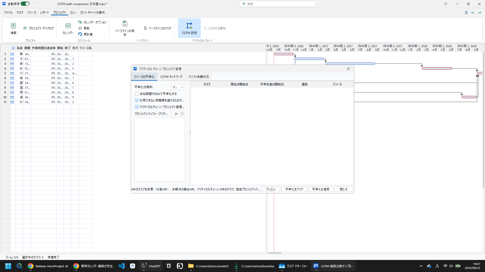
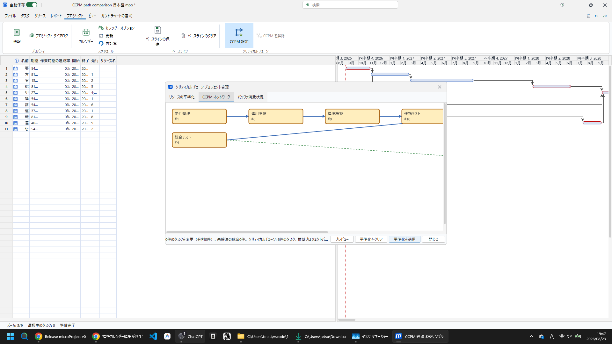
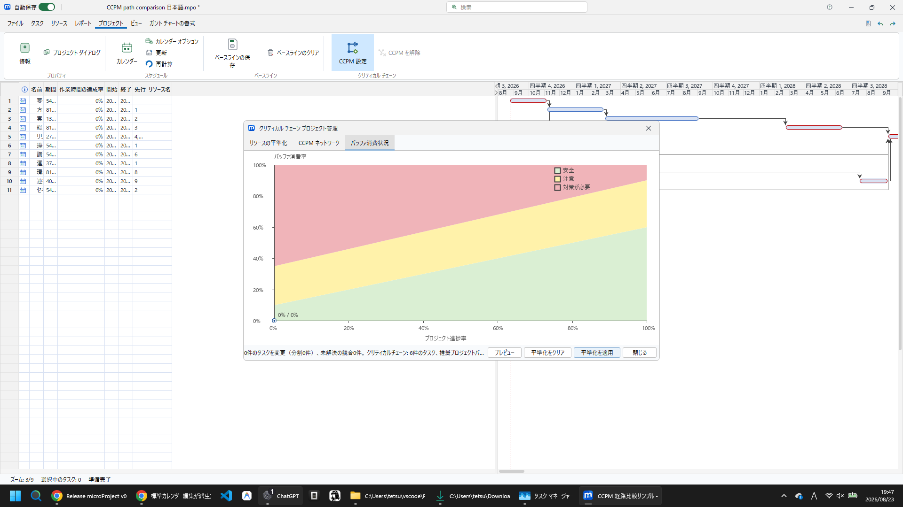

# CCPM 実践ガイド — 依存関係・リソース・遅れを正しく扱う

このガイドは、CCPM（Critical Chain Project Management）を初めて使う人が、通常のガントチャートからクリティカルチェーン、バッファ消費までを一貫して確認するための説明資料です。

対象サンプルは次の 2 ファイルです。

- `samples/CCPM path comparison 日本語.mpo`
- `samples/CCPM path comparison English.mpo`

どちらも同じ一般的なシステム開発プロジェクトを表します。依存関係は設定済みで、配布時点では **CCPM のベースラインは未作成**、全タスクの実績は 0% です。現行サンプルにはタスクへのリソース割当がないため、まず依存関係の基本シナリオを確認し、共有リソースのシナリオは後述の手順で追加します。



## 最初に見るタスク表

CCPM の判断に必要十分な列は、次のとおりです。

| 列 | 何を確認するか | CCPM での意味 |
| --- | --- | --- |
| 名前 | 作業の単位 | どの仕事が遅れているかを識別する |
| 期間 | 作業の見積り | チェーンとバッファの計算の基礎 |
| 残存期間 | 現時点の残り見積り | 遅れを後続日程とバッファへ反映する主な入力 |
| 開始 / 終了 | 現在の予定 | 依存関係・平準化の結果を確認する |
| 先行 | 前後関係 | 後続作業を開始できる条件 |
| リソース名 | 担当者・設備 | 同一リソースの競合を検出する |
| 作業時間の達成率 | 実際に消化した工数の比率 | 工数ベースの実績を確認する |
| 達成率 | 完成した成果の比率 | 作業の完了状態を確認する |
| クリティカル | 余裕のない作業か | 通常スケジュールの危険箇所を確認する |

「作業時間の達成率」と「達成率」は意味が違います。例えば、調査に予定工数の 80% を使っても、成果が半分しか完成していなければ、前者は 80%、後者は 50% になり得ます。遅れを日程へ反映するには、完成率だけではなく、実際の開始・終了と現在の残存期間の見積りを更新します。

## MS Project 風ガントチャートの読み方

ガントの色は遅延警告そのものではなく、主にタスク種別・進捗・クリティカル状態を表します。

| 見た目 | 意味 |
| --- | --- |
| 青いバー | 通常タスクの予定期間 |
| 青バー内部の濃い部分 | 達成率に応じた進捗 |
| 赤いバー | 通常のクリティカルパス上のタスク |
| 赤バー内部の濃い部分 | クリティカルタスクの進捗 |
| 黒い矢印線 | 依存関係。矢印の向きが後続タスク |
| 赤い点線 | 基準日／現在日の目安 |

そのため「赤いバーだから遅れている」とは限りません。赤は終了遅延を許容できない通常クリティカルパス上の作業を示します。実際の遅れは、開始・終了、達成率、基準日との差、および CCPM のバッファ消費で判断します。

## 通常のクリティカルパスと CCPM の違い

| 観点 | クリティカルパス（CP） | クリティカルチェーン（CCPM） |
| --- | --- | --- |
| 主な制約 | タスク間の依存関係 | 依存関係と共有リソース |
| 計算対象 | 総余裕が 0 の連鎖 | リソース競合を平準化した後の支配的な連鎖 |
| 遅れの見方 | 個々のクリティカル作業の遅れ | プロジェクト／合流バッファの消費 |
| 管理の焦点 | 各タスクを予定日どおりに終える | バッファを守り、全体納期を守る |

前後関係があるのに全タスクが同じ日に始まる場合は、先行列の値、リンク種別、手動スケジュール、実績開始日、または平準化遅延を確認します。自動スケジュールの未開始タスクであれば、先行タスクの終了とリンク種別に応じて後続日程が更新されます。実績開始日は履歴なので、CCPM 適用で強制的に移動しません。

## サンプルを使った手順

1. `CCPM path comparison 日本語.mpo` を開き、タスク表の「先行」を確認します。
2. ガントの黒い矢印が、先行作業から後続作業へつながっていることを確認します。
3. CCPM ビューで「設定」を開き、プロジェクト・バッファと合流バッファの候補を確認します。
4. **プレビュー**を実行します。プレビューは検討用であり、予定・レベリング・ベースラインを変更しません。
5. 内容を確認したうえで **適用**します。適用はリソース競合を平準化し、CCPM のベースラインを保存します。
6. 保存して閉じ、同じ `.mpo` を再度開きます。設定、ベースライン、バッファ状態が維持されることを確認します。



| 操作 | スケジュール | CCPM ベースライン | 用途 |
| --- | --- | --- | --- |
| プレビュー | 変更しない | 作成しない | 影響と候補を比較する |
| 適用 | リソース競合を平準化 | 作成・更新する | CCPM 管理を開始する |
| CCPM をクリア | CCPM 用の設定と遅延を解除する | 削除する | CCPM 適用前へ戻す |

> 注意: CCPM の設定・ベースラインを保持できるのは `.mpo` です。`.pod` に保存すると CCPM 固有の情報は保持されません。

## リソース競合はなぜチェーンになるのか

タスク A と B が同じ担当者を同じ期間に必要とする場合、作業順序を決めなければ同時には実行できません。CCPM の適用は、その競合を予定へ反映し、依存関係だけでは見えなかった制約をチェーンに含めます。

現行サンプルでこのケースを実習するには、リソース表で「開発者」を 1 名作成し、並行する「実装」と「環境構築」に 100% ずつ割り当てます。保存前にプレビューを実行して競合を確認し、適用後にいずれかの開始日が後ろへ移動することを確認します。この追加操作を行わないサンプルでは、競合数 0 件が正しい状態です。



ネットワーク上のリソース制約は、同じリソースを使う作業の重なりを示します。すべての線が固定の業務依存を意味するわけではなく、平準化の条件によってプレビュー結果は変わります。適用後は、タスク表の開始・終了とガントを必ず確認してください。

## 遅れを入力し、バッファへの影響を読む

CCPM を適用してベースラインを作成した後、実際の状況を入力します。

例: 「実装」が予定より 3 営業日遅れて開始し、まだ完了していない場合。

1. 実装タスクに実績開始日を入力します。
2. 実際に完了した成果に合わせて「達成率」を入力します。
3. 消化した工数が別に把握できる場合は「作業時間の達成率」も更新します。
4. 当初見積りより時間が必要なら「残存期間」を現在の見積りへ増やします。
5. 後続の未開始タスクを自動スケジュールとして再計算し、依存関係に沿って後ろへ動くことを確認します。
6. CCPM のバッファチャートで、プロジェクト・バッファまたは該当する合流バッファの消費を確認します。

実績開始・実績終了は過去の事実です。未開始の後続タスクは依存関係に従って動かせますが、すでに入力した実績を自動的に書き換えて帳尻を合わせることはしません。

## バッファチャートの見方



バッファ消費率は、概念的には次の式で求めます。

```
消費率 = max(0, 現在のプロジェクト終了日 − CCPM ベースライン終了日) ÷ 計画バッファ
```

表示は 0% から 100% の範囲に丸められます。ベースライン作成前は、推奨バッファの大きさをプレビューできますが、比較対象がないため消費は 0% として表示されます。

緑・黄・赤の境界は固定の「1/3・2/3」ではありません。進捗率を `p`（0〜100）とした場合、実装は次の動的な基準で判定します。

| ゾーン | 判定 |
| --- | --- |
| 緑 | バッファ消費率 ≤ `10 + 0.50 × p` |
| 黄 | 緑を超え、かつ消費率 ≤ `35 + 0.55 × p` |
| 赤 | 黄の上限を超える |

進捗の初期は小さな消費でも慎重に扱い、プロジェクトが進むほど許容される消費率も増える、という読み方です。赤は「必ず失敗」ではなく、原因を特定して回復策を決めるべき状態を示します。

## 敵対的レビューで確認する項目

CCPM は設定画面だけを見て完了にしないでください。次の反例を使って確認します。

- **依存関係が無視される**: 先行作業を延ばし、未開始の後続作業がリンク種別に従って移動するか確認する。
- **共有リソースが二重割当てされる**: 同じ担当者を同時期の 2 作業に割当て、プレビューと適用後で競合・開始日がどう変わるか確認する。
- **実績が予定を壊す**: 遅い実績開始日と中間の達成率を入力し、過去の実績が書き換えられず、未開始の後続のみが再計算されるか確認する。
- **保存後に状態が消える**: CCPM 適用後の `.mpo` を保存・再読込し、設定・ベースライン・バッファ表示を確認する。
- **旧ファイルで日程が飛ぶ**: 古い microProject MPO を開いた場合、旧形式の平準化遅延を分単位へ移行してからスケジュール計算することを確認する。
- **赤いガントバーを遅延と誤認する**: クリティカル状態とバッファ消費を別々に確認する。

このリポジトリでは、上記に対応して、依存関係スケジュール、MPO の平準化遅延の移行、CCPM のプレビュー・適用・クリア、保存／再読込を自動テストで確認しています。なお、大規模な共有リソース・プレビューの性能しきい値には既知の不安定なテストがあり、機能の正しさとは別に継続して監視します。

## 日常運用の要点

1. まず前後関係とリソースを正しく入力する。
2. CCPM を適用してベースラインを確定する。
3. 日々は実績開始日・達成率・作業時間の達成率を更新する。
4. 個別タスクの色だけで判断せず、バッファ消費の傾向を見る。
5. 赤に入ったら、遅れの原因、残作業、リソース競合、後続の合流点を確認して対策を決める。
